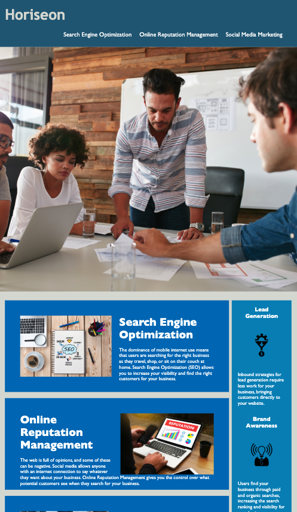

## Homework_1

01 HTML CSS Git: Code Refactor

## Repository

1. html file for the refactor webpage
2. assets include images used and css for style



# Scope

To impress clients, you should always go the extra mile and improve their codebase for long term sustainability. Ensure that all links are functioning correctly and clean up the CSS to make it more efficient, consolidating CSS selectors and properties, organizing them to follow the semantic structure of the HTML elements, and including comments before each element or section of the page.

## User Story

```
AS A marketing agency
I WANT a codebase that follows accessibility standards
SO THAT our own site is optimized for search engines
```

## Acceptance Criteria

```
GIVEN a webpage meets accessibility standards
WHEN I view the source code
THEN I find semantic HTML elements
WHEN I view the structure of the HTML elements
THEN I find that the elements follow a logical structure independent of styling and positioning
WHEN I view the image elements
THEN I find accessible alt attributes
WHEN I view the heading attributes
THEN they fall in sequential order
WHEN I view the title element
THEN I find a concise, descriptive title
```

## Usage

- The URL of the deployed application: https://tonyhotant.github.io/homework_1/

- The URL of the GitHub repository: https://github.com/tonyhotant/homework_1.git

## Log

v1.0 14/02/20 initial release

## To do

1. continue improve SEO
2. better class name
3. better comments
4. more responsive with different sizes of devices
